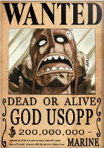
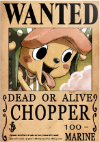
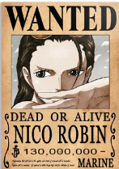
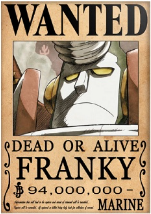
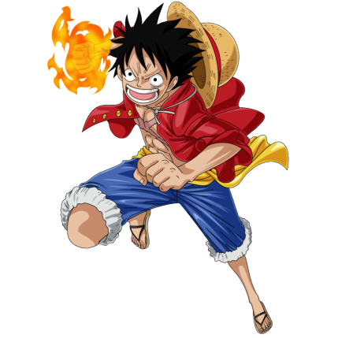

# Projeto One Piece 

Esse é um projeto de Front-end com base nas aulas gratuitas do Dev Em Dobro. O projeto é constitído de cartazes de oito personagens do One Piece que quando selecionado aparece foto e descrição do personagem.

## Índice

- [Overview](#overview)
  - [Print do Projeto](#print-do-projeto)
  - [Links](#links)
- [Meu processo](#meu-processo)
  - [Construído com](#construído-com)
  - [O que aprendi](#o-que-aprendi)
  - [Códigos Utilizados](#codigos-utilizados)
- [Autor](#autor)
- [Agradecimento](#agradecimento)

## Overview

### Print do projeto


### Links

- URL da solução: [Repositório](https://github.com/maiarasteffen/onePiece)
- URL do site: [Site](https://maiarasteffen.github.io)

## Meu Processo

### Construído com

- Marcação HTML5 semântica
- Propriedades personalizadas do CSS
- Flexbox
- Grade CSS
- Fluxo de trabalho móvel primeiro
- Google Fonts


### O que aprendi

Aprendi a desenvolver melhor tanto para visualização em desktop como para visualização em mobile. Também aprendi a ciar funções separadas utilizando o próprio editor de código, facilitando muito para quem visualiza, mesmo não tendo comentário.

### Códigos utilizados:

```html
<header class="cabecalho">
        
    </header>
    <main class="selecao-de-personagens">
        <section class="personagens">
            <h1 class="titulo">Selecione um personagem</h1>
            <ul class="lista-de-personagens">
                <li class="personagem selecionado" id="luffy" data-name="Monkey-D-Luffy" data-description="Ele é o capitão e sua missão é se tornar o Rei dos Piratas, também comeu o Gomo-gomo-nomy, a fruta que deu poderes de elasticidade.">
                    
                </li>
                <li class="personagem" id="zoro" data-name="Roronoa Zoro" data-description="Conhecido pelos que o temem como o caçador de piratas, mas seu desejo sempre foi se tornar o maior espadachim da Grand Line para cumprir a promessa que fez a sua amiga quando criança.">
                    
                </li>
                <li class="personagem" id="nami" data-name="Nami" data-description="É uma jovem muito linda e também ambiciosa, é considerada a melhor navegadora da Grand Line por sua capacidade de previsão de tempo.">
                    
                </li>
                <li class="personagem" id="usopp" data-name="Usopp" data-description="Um grande mentiroso e com habilidades para miras com estilingues, suas criações ajudam a todos do navio.">
                    
                </li>
                <li class="personagem" id="sanji" data-name="Sanji" data-description="Um cozinheiro de mão cheia, com habilidades de utilizar toda a comida sem desperdício. Seu sonho é encontrar o mar mítico onde os peixes de todos os quatro dos mares do mundo se reúnem.">
                    
                </li>
                <li class="personagem" id="chopper" data-name="Chopper" data-description="Um alce que comeu uma cumanomi e consegue se transformar em homem, ele adora ser paparicado e é um excelente médico.">
                    
                </li>
                <li class="personagem" id="robin" data-name="Nico Robin" data-description="Desde criança foi nomeada uma historiadora grandiosa, seguindo o exemplo de sua mãe. Também comeu a fruta do diabo que tem poderes de multiplicar partes de seu corpo.
                ">
                    
                </li>
                <li class="personagem" id="franky" data-name="Franky" data-description="O carpinteiro, que quando criança ajudou a construir o navio do Gold-Roger. Ele é como um ciborgue que para repor energia precisa de refrigerante.">
                    
                </li>
            </ul>
        </section>
        <section class="personagem-selecionado">
            
            <div class="informacoes-personagem">
                <h2 id="nome-personagem" class="nome-personagem">Monkey-D-Luffy</h2>
                <p class="descricao-personagem" id="descricao-personagem">Ele é o capitão e sua missão é se tornar o Rei dos Piratas, também comeu o Gomo-gomo-nomy, a fruta que deu poderes de elasticidade.</p>
            </div>
        </section>
    </main>
    <script src="./src/js/index.js"></script>
```
```css estilo
body {
    font-family: 'Times new Roman', serif;
    background-color: #000;
    color: #fff;
}

body::before {
    content: '';
    background-image: url(../img/mapa-one-piece.jpg);
    background-repeat: no-repeat;
    background-size: cover;
    background-position: center;
    width: 100%;
    height: 100%;
    position: absolute;
    z-index: -1;
    opacity: 0.2;
}

.logo {
    width: 252px;
}

.cabecalho {
    display: flex;
    justify-content: center;
}

.selecao-de-personagens {
    display: flex;
    align-items: center;
    gap: 30px;
    min-height: calc(100vh - 152px);
    justify-content: center;
}

.selecao-de-personagens .lista-de-personagens {
    display: flex;
    flex-wrap: wrap;
    gap: 20px;
    justify-content: center;
}

.selecao-de-personagens .personagens {
    display: flex;
    flex-direction: column;
    align-items: center;
    max-width: 700px;
    gap: 25px;
}

.selecao-de-personagens .personagens .titulo {
    font-size: 30px;
    letter-spacing: 2px;
    text-transform: uppercase;
    border-bottom: 4px solid #E32E1B;
    width: 100%;
    text-align: center;
}

.lista-de-personagens .personagem {
    border-bottom: 4px solid #E32E1B;
}

.lista-de-personagens .personagem img {
    width: 100%;
    height: 100%;
}

.lista-de-personagens .personagem.selecionado {
    box-shadow: 0px 0px 24px 5px #E32E1B;
}

.personagem-selecionado {
    text-align: center;
    max-height: 530px;
}

.personagem-selecionado .personagem-grande {
    width: 430px;
    height: 430px;
}

.personagem-selecionado .nome-personagem {
    border-bottom: 4px solid #E32E1B;
    letter-spacing: 2px;
    text-transform: uppercase;
}

.personagem-selecionado .descricao-personagem {
    font-size: 23px;
    letter-spacing: 2px;
    line-height: 22px;
    text-align: center;
    margin: 20px auto;
    width: 420px;
}
```
``` css responsivo
@media (max-width: 1120px) {

    body::before {
        padding: 130px 0px;
    }
    .cabecalho .logo {
        max-width: 190px;
    }

    .selecao-de-personagens {
        flex-direction: column-reverse;
        max-width: 430px;
        margin: 30px auto;
    }

    .selecao-de-personagens .personagens {
        margin-top: 30px;
    }

    .selecao-de-personagens .personagens .titulo {
        font-size: 20px;
    }

    .selecao-de-personagens .lista-de-personagens {
        gap: 9px;
    }

    .selecao-de-personagens .personagem img{
        width: 80px;
    }

    .personagem-selecionado .personagem-grande {
        width: 350px;
        height: 350px;
    }

    .personagem-selecionado .descricao-personagem {
        width: 80%;
        font-size: 20px;
        margin: 20px auto;
    }
}
```
``` JS
const personagens = document.querySelectorAll('.personagem');

personagens.forEach((personagem) => {
    personagem.addEventListener('mouseenter', () => {

        if(window.innerWidth < 450) {
            window.scrollTo({top: 0, behavior: 'smooth'});
        }
        
        //Verificar se existe personagem selecionado
        removerSelecaoDoPersonagem();

        personagem.classList.add('selecionado');

        alterarImagemPersonagemSelecioando(personagem);

        alterarNomePersonagemSelecionado(personagem);

        alterarDescricaoPersonagem(personagem);

    })
});

function alterarDescricaoPersonagem(personagem) {

    const descricaoPersonagem = document.getElementById("descricao-personagem");
    descricaoPersonagem.innerText = personagem.getAttribute('data-description');
}

function alterarNomePersonagemSelecionado(personagem) {

    const nomePersonagem = document.getElementById("nome-personagem");
    console.log(nomePersonagem);
    nomePersonagem.innerText = personagem.getAttribute('data-name');
}

function alterarImagemPersonagemSelecioando(personagem) {

    const imagemPersonagemGrande = document.querySelector('.personagem-grande');
    const idPersonagem = personagem.attributes.id.value;

    imagemPersonagemGrande.src = `../src/img/${idPersonagem}_grande.png`;
}

function removerSelecaoDoPersonagem() {

    const personagemSelecionado = document.querySelector('.selecionado');
    personagemSelecionado.classList.remove('selecionado');
}
```

## Autor

- Frontend Mentor - [@maiarasteffen](https://www.frontendmentor.io/profile/maiarasteffen)
- LinkedIn - [@maiarasteffen](https://www.linkedin.com/in/maiara-steffen/)
- Instagram - [@maiara_steffen](https://www.instagram.com/maiara_steffen/)


## Agradecimento

Quero agradecer muito ao [Dev em dobro](https://www.instagram.com/devemdobro/) que me ajudou em suas lives a me mostrar a forma mais simplificada e funcional para codar.
